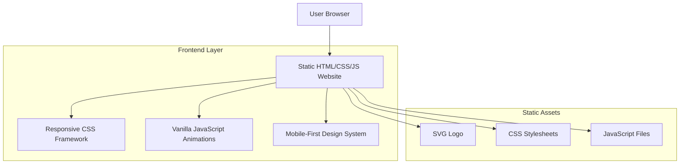

# Godmode Website Redesign - Technical Architecture Document

## 1. Architecture Design



## 2. Technology Description

- Frontend: HTML5 + CSS3 + Vanilla JavaScript
- Styling: Custom CSS with CSS Grid, Flexbox, and CSS Animations
- Icons: SVG graphics for scalability and performance
- Responsive: CSS Media Queries with mobile-first approach

## 3. Route Definitions

| Route | Purpose |
|-------|---------|
| /index.html | Home page with hero section, features, and app download links |
| /privacy.html | Privacy Policy with structured legal content and navigation |
| /terms.html | Terms of Service with organized legal sections |
| /contact.html | Contact information and support channels |

## 4. Frontend Architecture

### 4.1 File Structure
```
godmode-site/
├── index.html          # Main landing page
├── privacy.html        # Privacy policy page
├── terms.html          # Terms of service page
├── contact.html        # Contact page
├── godmode-logo.svg    # Brand logo
├── styles/
│   ├── main.css        # Global styles and variables
│   ├── components.css  # Reusable component styles
│   └── animations.css  # Animation definitions
└── scripts/
    ├── main.js         # Core functionality
    ├── animations.js   # Animation controllers
    └── mobile.js       # Mobile-specific interactions
```

### 4.2 CSS Architecture

**CSS Custom Properties (Variables)**
```css
:root {
  --color-primary: #0A0A0A;
  --color-accent: #00D4FF;
  --color-secondary: #1A1A1A;
  --color-text: #F5F5F5;
  --color-text-muted: #9ECFFF;
  --gradient-primary: linear-gradient(135deg, #00D4FF 0%, #8B5CF6 100%);
  --border-radius: 8px;
  --transition-speed: 0.3s;
  --shadow-subtle: 0 4px 6px rgba(0, 0, 0, 0.1);
}
```

**Responsive Breakpoints**
```css
/* Mobile First Approach */
@media (min-width: 768px) { /* Tablet */ }
@media (min-width: 1024px) { /* Desktop */ }
@media (min-width: 1440px) { /* Large Desktop */ }
```

### 4.3 JavaScript Architecture

**Module Pattern for Organization**
```javascript
// Main application controller
const GodmodeApp = {
  init: function() {
    this.setupNavigation();
    this.initAnimations();
    this.handleMobileInteractions();
  },
  
  setupNavigation: function() {
    // Mobile menu toggle
    // Smooth scrolling
    // Active page highlighting
  },
  
  initAnimations: function() {
    // Intersection Observer for scroll animations
    // Hover effects
    // Page transition animations
  }
};
```

## 5. Performance Optimization

### 5.1 CSS Optimization
- Critical CSS inlined in HTML head
- Non-critical CSS loaded asynchronously
- CSS animations use transform and opacity for GPU acceleration
- Minimal CSS framework overhead

### 5.2 JavaScript Optimization
- Vanilla JavaScript for minimal bundle size
- Event delegation for efficient event handling
- Intersection Observer API for scroll-based animations
- Debounced resize handlers for responsive behavior

### 5.3 Asset Optimization
- SVG logo for scalability and small file size
- Optimized CSS with minimal redundancy
- Compressed and minified production assets
- Efficient CSS Grid and Flexbox layouts

## 6. Accessibility Features

### 6.1 WCAG Compliance
- Semantic HTML structure
- Proper heading hierarchy (h1-h6)
- Alt text for all images
- Keyboard navigation support
- Focus indicators for interactive elements

### 6.2 Responsive Design
- Mobile-first approach
- Touch-friendly button sizes (minimum 44px)
- Readable font sizes across all devices
- Proper color contrast ratios
- Reduced motion support for accessibility

### 6.3 Progressive Enhancement
- Core functionality works without JavaScript
- Enhanced experience with JavaScript enabled
- Graceful degradation for older browsers
- Fast loading with minimal dependencies