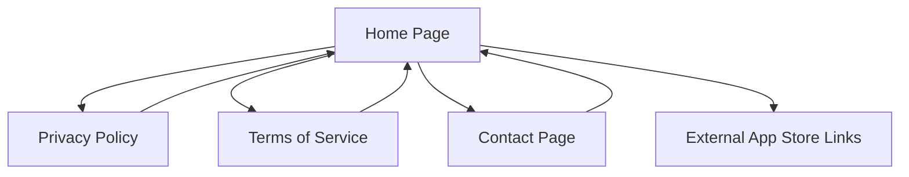

# Godmode Website Redesign - Product Requirements Document

## 1. Product Overview

A complete redesign of the Godmode AI fitness app website to deliver a premium, modern user experience across all devices. The redesigned website will serve as the primary digital touchpoint for users to learn about the app, access legal information, and contact support.

The redesign focuses on creating a mobile-first, responsive experience with smooth animations, improved accessibility, and a cohesive dark theme that reflects the premium nature of the AI fitness companion app.

## 2. Core Features

### 2.1 User Roles

No user authentication or role distinction is required for this website. All content is publicly accessible.

### 2.2 Feature Module

Our redesigned Godmode website consists of the following main pages:
1. **Home page**: hero section with animated elements, feature highlights, app download links, responsive navigation
2. **Privacy Policy page**: structured legal content with improved readability, breadcrumb navigation, mobile-optimized layout
3. **Terms of Service page**: organized legal terms with enhanced typography, smooth scrolling, and mobile-friendly formatting
4. **Contact page**: streamlined contact information with interactive elements and feedback options

### 2.3 Page Details

| Page Name | Module Name | Feature description |
|-----------|-------------|---------------------|
| Home page | Hero Section | Animated logo display, compelling headline with typewriter effect, gradient backgrounds, call-to-action buttons with hover animations |
| Home page | Navigation | Responsive hamburger menu for mobile, smooth slide transitions, active page indicators, logo branding |
| Home page | Feature Highlights | Card-based layout showcasing app benefits, hover effects with scale animations, mobile-optimized grid |
| Home page | App Download | Prominent download buttons with platform detection, animated icons, social proof elements |
| Privacy Policy | Header Navigation | Consistent navigation bar with breadcrumbs, mobile hamburger menu, smooth page transitions |
| Privacy Policy | Content Layout | Structured sections with collapsible content, improved typography hierarchy, mobile-optimized reading experience |
| Privacy Policy | Interactive Elements | Smooth scroll to sections, expandable content blocks, progress indicator for long content |
| Terms of Service | Header Navigation | Consistent navigation with current page highlighting, mobile-responsive menu system |
| Terms of Service | Content Structure | Organized legal sections with clear headings, mobile-friendly text sizing, interactive table of contents |
| Terms of Service | User Experience | Smooth scrolling between sections, readable typography, mobile-optimized layout |
| Contact | Header Navigation | Consistent site navigation with contact page highlighting, responsive menu system |
| Contact | Contact Information | Clear contact methods with interactive elements, email link with hover effects, response time indicators |
| Contact | Feedback Integration | Information about in-app feedback options, support channel descriptions, mobile-optimized layout |

## 3. Core Process

**Main User Flow:**
Users typically start on the home page to learn about Godmode, then may navigate to legal pages (Privacy Policy, Terms of Service) for compliance information, or visit the Contact page for support. The navigation should be intuitive and consistent across all pages.

**Mobile User Flow:**
Mobile users access the hamburger menu to navigate between pages, with touch-friendly buttons and optimized content layout for smaller screens.

## 4. User Interface Design

### 4.1 Design Style

- **Primary Colors**: Deep black (#0A0A0A) background, electric blue (#00D4FF) for accents and CTAs
- **Secondary Colors**: Dark gray (#1A1A1A) for cards, light blue (#9ECFFF) for links, white (#F5F5F5) for text
- **Gradient Accents**: Blue to purple gradients (#00D4FF to #8B5CF6) for hero sections and buttons
- **Button Style**: Rounded corners (8px), gradient backgrounds with hover animations, subtle shadows
- **Typography**: Modern sans-serif (Inter or system fonts), 16px base size, 1.6 line height for readability
- **Layout Style**: Card-based design with subtle shadows, generous white space, mobile-first responsive grid
- **Animation Style**: Smooth CSS transitions (0.3s ease), subtle hover effects, fade-in animations on scroll
- **Icon Style**: Minimalist line icons, consistent stroke width, animated hover states

### 4.2 Page Design Overview

| Page Name | Module Name | UI Elements |
|-----------|-------------|-------------|
| Home page | Hero Section | Full-width gradient background, centered logo with pulse animation, large typography with fade-in effects, animated CTA buttons |
| Home page | Navigation | Fixed header with transparent background, hamburger menu (mobile), smooth slide animations, logo with hover effect |
| Home page | Feature Cards | Grid layout with hover lift effects, gradient borders, icon animations, mobile-stacked layout |
| Privacy Policy | Header | Consistent navigation bar, breadcrumb trail, page title with subtle animation, mobile-optimized spacing |
| Privacy Policy | Content | Two-column layout (desktop), single column (mobile), collapsible sections, smooth scroll indicators |
| Terms of Service | Header | Matching navigation design, clear page identification, responsive layout adjustments |
| Terms of Service | Content | Structured typography hierarchy, interactive table of contents, mobile-friendly text sizing |
| Contact | Header | Consistent site branding, navigation highlighting, responsive design patterns |
| Contact | Content | Centered layout with contact cards, hover effects on email links, mobile-optimized spacing |

### 4.3 Responsiveness

The website follows a mobile-first approach with breakpoints at 768px (tablet) and 1024px (desktop). Touch interactions are optimized for mobile devices with larger tap targets and gesture-friendly navigation. All animations are performance-optimized and respect user preferences for reduced motion.

Key responsive features:
- Hamburger navigation menu for mobile devices
- Flexible grid layouts that adapt to screen size
- Touch-friendly button sizes (minimum 44px)
- Optimized typography scaling across devices
- Performance-conscious animations that work smoothly on all devices